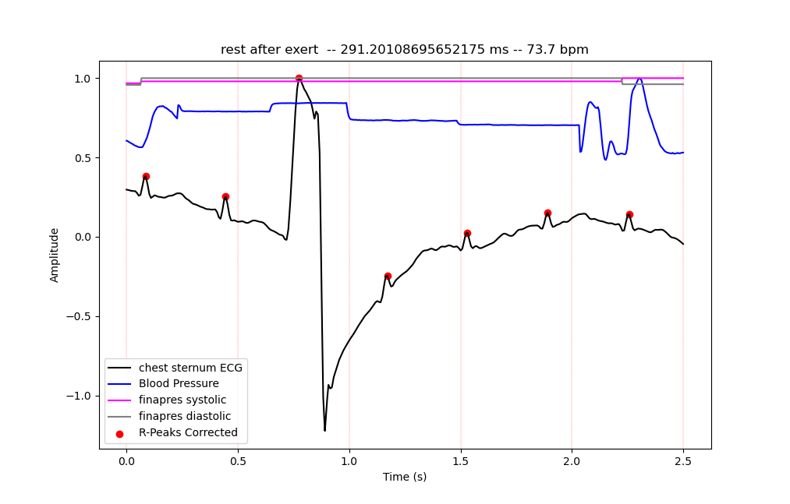
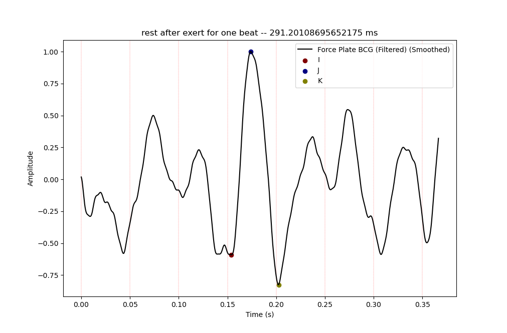
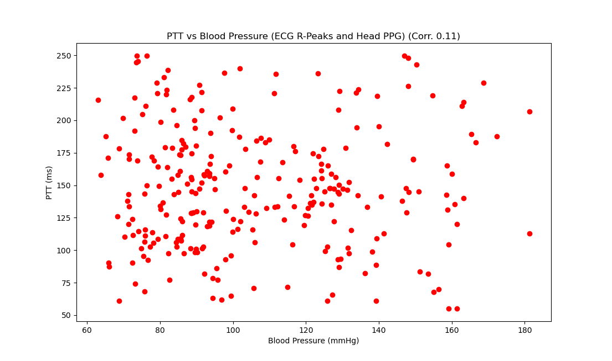
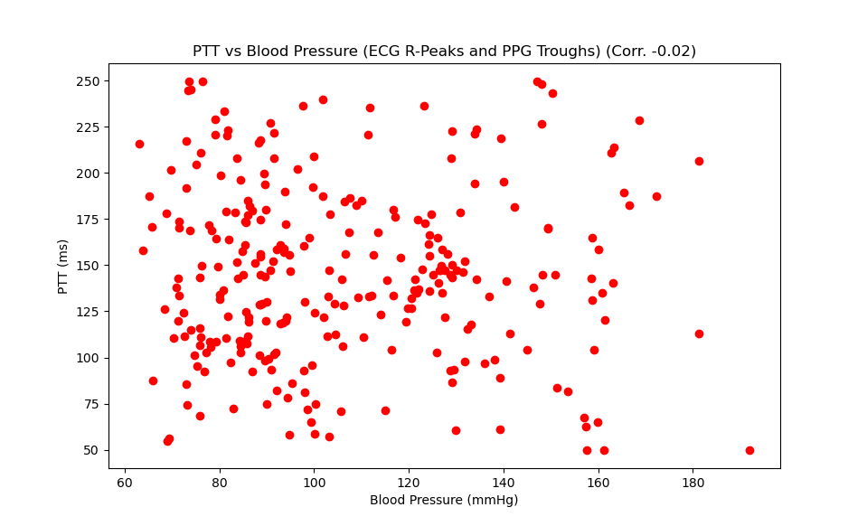
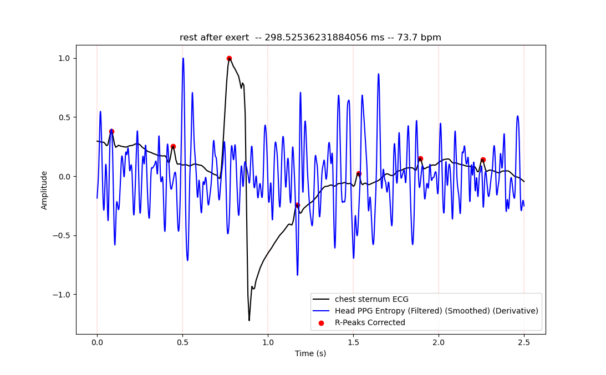
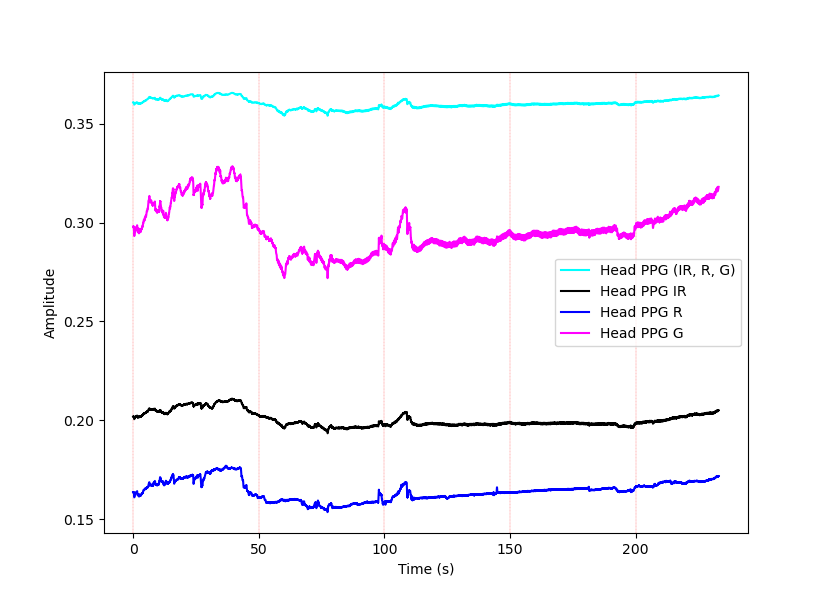

# Project Name

PTT Comparison

## Description

Purpose is to extract PTT from various sensors and compare the results.

Expected correleation between PTT and BP is negative and close to 1. Found correletation between PTT and BP is -0.02 for 
Finger PPG calculation and 0.11 for Head PPG calculation. Only Force Plate BCG data' re used. No calculations' re done using IMU BCG.

Custom Peak Detection algorithm can be compared with built - in scipy.signal.find_peaks (see the script for details).

PTT calculations are done by:

1. Extract R-peaks from ECG data
2. Correction of R-peaks
3. Extract IJK points from BCG data
4. Extract trough points from PPG data using J - peaks (Maxima of the first differential is considered instead of intersecting tangent method).
5. Calculate PTT by taking the difference between R - peaks and trough points (in some cases, I - valleys are used instead of R - peaks).

## Installation

Necessary packages are listed in `environment.yml`. To install them, run the following command (assuming you have Anaconda installed):

```bash
conda env create -f environment.yml
```

## Screenshots









# To - Do

- [x] Add PTT calculation using IMU BCG data
- [x] UI arrangement
- [x] Maybe add K-means to remove outliers after processing